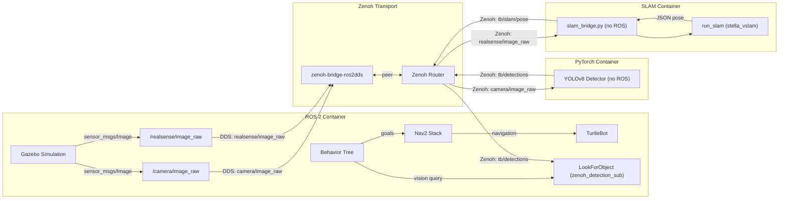
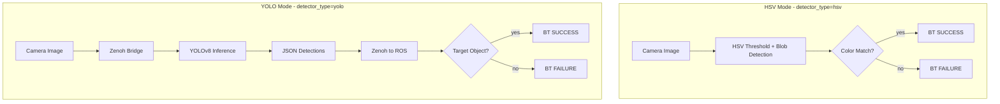
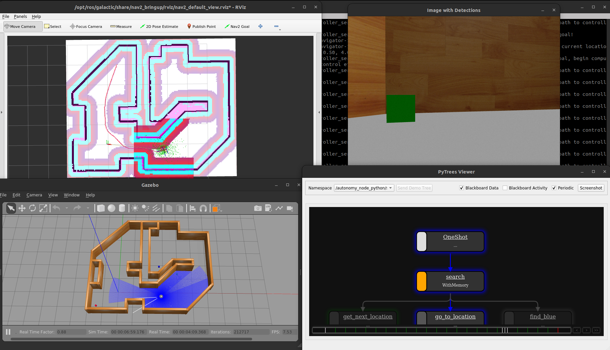
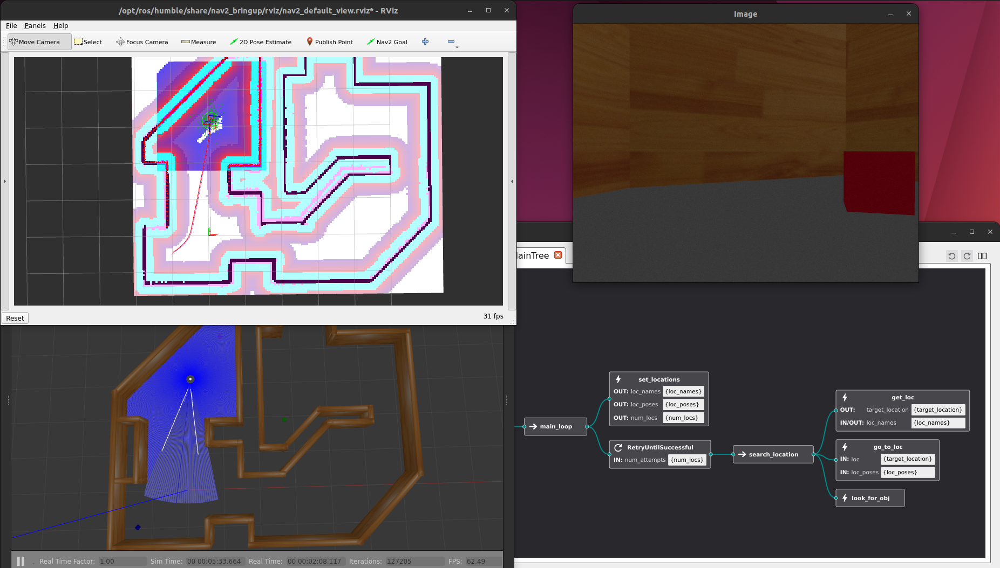
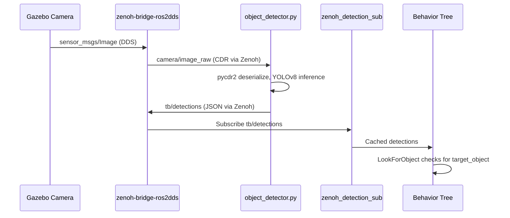
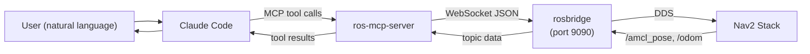

# TurtleBot Behavior Demos

Autonomous navigation demos for a simulated [ROBOTIS TurtleBot](https://emanual.robotis.com/docs/en/platform/turtlebot3/overview/#overview) using ROS 2 Jazzy and behavior trees.

The robot navigates a house environment searching for objects using vision (HSV color thresholding or YOLOv8 deep learning) and [Nav2](https://docs.nav2.org/)-based path planning.

**Behavior trees** drive the autonomy — see [this introduction](https://roboticseabass.com/2021/05/08/introduction-to-behavior-trees/) or the [BT textbook](https://arxiv.org/abs/1709.00084).
Docker workflows follow [this guide](https://roboticseabass.com/2023/07/09/updated-guide-docker-and-ros2/).

Originally by Sebastian Castro, 2021-2024. As of 2025, Pantelis Monogioudis and staff are enhancing the original implementation with Object Detection, VSLAM, and other AI algorithms.  

---

## Architecture

### System Overview

The key architectural principle is that heavyweight ML inference (YOLOv8, stella_vslam) runs in standalone containers with **no ROS dependency**, communicating entirely via [Zenoh](https://zenoh.io/). Camera images enter Zenoh through `zenoh-bridge-ros2dds`; detection results (`tb/detections`) and SLAM poses (`tb/slam/pose`) are published back over Zenoh as JSON. The behavior tree node `zenoh_detection_sub` subscribes to `tb/detections` via Zenoh to bring results back into the ROS behavior tree — but the detection itself never touches ROS.



### Docker Services

| Service | Image / Dockerfile | Purpose |
|---|---|---|
| `base` | `Dockerfile.gpu` → `base` | ROS 2 Jazzy + Cyclone DDS + Gazebo dependencies |
| `overlay` | `Dockerfile.gpu` → `overlay` | Adds `tb_autonomy` + `tb_worlds` packages, Nav2, BT libs |
| `dev` | `Dockerfile.gpu` → `dev` | Development container with source mounts + Groot2 |
| `demo-world` | extends `overlay` | Launches Gazebo house world |
| `demo-world-enhanced` | extends `overlay` | Enhanced world with 3m textured walls and ArUco markers |
| `demo-behavior-py` | extends `overlay` | Python behavior tree demo (py_trees) |
| `demo-behavior-cpp` | extends `overlay` | C++ behavior tree demo (BehaviorTree.CPP) |
| `zenoh-router` | `eclipse/zenoh:latest` | Zenoh router for pub/sub discovery |
| `zenoh-bridge` | extends `overlay` | `zenoh-bridge-ros2dds` — bridges DDS topics to Zenoh keys |
| `foxglove-bridge` | extends `overlay` | `foxglove-bridge` WebSocket server on port 8765 for Foxglove Studio |
| `rosbridge` | extends `overlay` | rosbridge WebSocket server on port 9090 for ros-mcp-server |
| `detector` | `Dockerfile.torch.gpu` | PyTorch YOLOv8 object detector (zero ROS dependencies) |
| `demo-slam` | `Dockerfile.slam` | stella_vslam Visual SLAM with Zenoh transport (zero ROS dependencies) |
| `detection-logger` | `Dockerfile.torch.gpu` | Subscribes to `tb/detections`, appends JSONL to `data/detections/` |
| `slam-logger` | `Dockerfile.torch.gpu` | Subscribes to `tb/slam/**`, appends JSONL to `data/slam/` |
| `test-detection-logging` | `Dockerfile.torch.gpu` | Runs the full pytest suite for the logging pipeline |

### Vision Pipeline

Two detection modes, switchable via the `DETECTOR_TYPE` environment variable:



### Repository Layout

```
turtlebot-maze/
├── tb_autonomy/              # ROS 2 autonomy package
│   ├── python/tb_behaviors/  #   Python behavior library (vision, navigation)
│   ├── scripts/              #   ROS nodes (autonomy_node, zenoh_detection_sub)
│   ├── launch/               #   Launch files (py + cpp demos)
│   ├── src/                  #   C++ behavior tree plugins
│   └── include/              #   C++ headers
├── tb_worlds/                # Gazebo worlds, maps, Nav2 config
├── detector/                 # Standalone PyTorch detector (no ROS)
│   ├── object_detector.py         #   Zenoh sub → YOLOv8 → Zenoh pub
│   ├── zenoh_logger.py            #   Generic Zenoh → JSONL logger (any key)
│   ├── query_detections.py        #   Query/export JSONL or live Zenoh storage
│   ├── test_detection_logging.py  #   pytest suite (26 tests, detection + SLAM)
│   └── requirements.txt           #   ultralytics, eclipse-zenoh, pycdr2, pytest
├── zenoh/
│   └── zenoh-storage.json5   # Zenoh router config: storage-manager plugin
├── data/
│   ├── detections/           # Host-mounted detection JSONL output
│   └── slam/                 # Host-mounted SLAM JSONL output
├── docker/                   # Dockerfiles + entrypoint
│   ├── Dockerfile.gpu        #   Multi-stage ROS 2 build (base/overlay/dev)
│   └── Dockerfile.torch.gpu  #   PyTorch container (CUDA + Ultralytics)
├── bt_xml/                   # Behavior tree XML definitions
├── docker-compose.yaml       # All service definitions
└── .env                      # Default environment variables
```

### Key Parameters

| Parameter | Default | Options | Description |
|---|---|---|---|
| `ROS_DISTRO` | `jazzy` | — | ROS 2 distribution |
| `TURTLEBOT_MODEL` | `3` | `3`, `4` | TurtleBot model |
| `BT_TYPE` | `queue` | `naive`, `queue` | Behavior tree variant |
| `ENABLE_VISION` | `true` | `true`, `false` | Enable vision behaviors |
| `TARGET_COLOR` | `blue` | `red`, `green`, `blue` | HSV detection target |
| `DETECTOR_TYPE` | `hsv` | `hsv`, `yolo` | Vision pipeline mode |
| `TARGET_OBJECT` | `cup` | Any COCO class | YOLO detection target |

---

## Setup

### Docker Setup (Recommended)
First, install Docker and Docker Compose using [the official install guide](https://docs.docker.com/engine/install/ubuntu/).

To run Docker containers with NVIDIA GPU support, you can optionally install the [NVIDIA Container Toolkit](https://github.com/NVIDIA/nvidia-docker).

Clone this repository and go into the top-level folder:

```bash
git clone https://github.com/sea-bass/turtlebot3_behavior_demos.git
cd turtlebot3_behavior_demos
```

Build the Docker images.
This will take a while and requires approximately 5 GB of disk space.

```bash
docker compose build
```

#### VSCode Dev Container

Open the project in VSCode and select **Reopen in Container** when prompted. VSCode attaches to the **`dev`** service by default — a shell container with the full source tree mounted at `/workspaces/turtlebot-maze` and the ROS 2 workspace sourced. This is the right environment for editing code, running `colcon build`, and using ROS 2 CLI tools.

The simulation (Gazebo + RViz2) is **not** started automatically. Launch it in a separate terminal on the host:

```bash
# Standard world
docker compose up demo-world

# Enhanced world (3 m textured walls + ArUco markers)
docker compose up demo-world-enhanced
```

Because all services share `network_mode: host`, the `dev` container and the simulation container see the same ROS 2 topics. You can run `ros2 topic list`, navigate the robot, or trigger behavior trees from the VSCode terminal while Gazebo runs alongside.

> **Note:** Do not run `demo-world` and `demo-world-enhanced` at the same time — both bind the same gz-sim ports.

### Local Setup

If you do not want to use Docker, you can directly clone this package to a Colcon workspace and build it provided you have the necessary dependencies.
As long as you can run the examples in the [TurtleBot3 manual](https://emanual.robotis.com/docs/en/platform/turtlebot3/overview/#overview), you should be in good shape.

First, make a Colcon workspace and clone this repo there:

```
mkdir -p turtlebot3_ws/src
cd turtlebot3_ws/src
git clone https://github.com/sea-bass/turtlebot3_behavior_demos.git
```

Clone the external dependencies:

```
sudo apt-get install python3-vcstool
vcs import < turtlebot3_behavior_demos/dependencies.repos
```

Set up any additional dependencies using rosdep:

```
sudo apt update && rosdep install -r --from-paths . --ignore-src --rosdistro $ROS_DISTRO -y
```

Ensure you have the necessary Python packages for these examples:

```
pip3 install matplotlib transforms3d
```

Then, build the workspace.

```
cd turtlebot3_ws
colcon build
```

NOTE: For best results, we recommend that you change your ROS Middleware (RMW) implementation to Cyclone DDS by following [these instructions](https://docs.ros.org/en/jazzy/Installation/RMW-Implementations/DDS-Implementations/Working-with-Eclipse-CycloneDDS.html).

---

## Basic Usage

We use [Docker Compose](https://docs.docker.com/compose/) to automate building, as shown above, but also for various useful entry points into the Docker container once it has been built.
**All `docker compose` commands below should be run from your host machine, and not from inside the container**.

To enter a Terminal in the overlay container:

```
docker compose run overlay bash
```

Once inside the container, you can verify that display in Docker works by starting a basic Gazebo simulation included in the standard TurtleBot3 packages:

```
ros2 launch turtlebot3_gazebo turtlebot3_world.launch.py
```

Alternatively, you can use the pre-existing `sim` service to do this in a single line:

```
docker compose up sim
```

If you want to develop using Docker, you can also launch a dev container using:

```
# Start the dev container
docker compose up dev

# Open as many interactive shells as you want to the container
docker compose exec -it dev bash
```

---

## Behavior Trees Demo

The robot navigates known locations searching for the same colored blocks placed in the simulated house. Two vision modes are available:

- **HSV mode** (default): Color thresholding in the [HSV color space](https://en.wikipedia.org/wiki/HSL_and_HSV) — finds the colored blocks directly by hue (red, green, blue)
- **YOLO mode**: YOLOv8 deep learning — finds the same colored blocks by their nearest [COCO class](https://docs.ultralytics.com/datasets/detect/coco/) label (the blocks appear as `suitcase` at 50–60% confidence with YOLOv8n)

### Starting the Simulation

```bash
docker compose up demo-world
```

### HSV Mode (Default)

```bash
# Python behavior tree
docker compose up demo-behavior-py

# With custom parameters
TARGET_COLOR=green BT_TYPE=queue ENABLE_VISION=true docker compose up demo-behavior-py
```

### YOLO Mode (Deep Learning)

YOLO mode requires the Zenoh bridge and PyTorch detector services.
Run each command in a separate terminal, in order:

```bash
# Terminal 1: Enhanced world (textured walls + ArUco markers)
docker compose up demo-world-enhanced

# Terminal 2: Zenoh router + DDS bridge + YOLO detector
docker compose up zenoh-router zenoh-bridge detector

# Terminal 3: Behavior demo in YOLO mode
DETECTOR_TYPE=yolo TARGET_OBJECT=suitcase BT_TYPE=queue ENABLE_VISION=true docker compose up demo-behavior-py
```

> **`TARGET_OBJECT` and the colored blocks:** The COCO 80-class set has no `box` or `block` class.
> The simulation blocks are closest in shape to a `suitcase` (rigid rectangular object, 50–60% confidence).
> Use `TARGET_OBJECT=suitcase` to mirror what HSV mode finds with `TARGET_COLOR`.
> Other objects visible in the enhanced world:
>
> | Object in scene | YOLO class | Typical confidence |
> |----------------|-----------|-------------------|
> | Colored blocks (HSV targets) | `suitcase` | 50–60% |
> | Gazebo floor/furniture | `bed` | 50–70% |
> | ArUco markers / wall panels | `tv` | 50–70% |
>
> To verify what YOLO sees before launching the behavior demo, subscribe to the `tb/detections` Zenoh key from inside the detector container:
>
> ```bash
> docker compose exec detector python3 -c "
> import zenoh, time, json
> def cb(s):
>     d = json.loads(s.payload.to_bytes())
>     if d: print(d)
> s = zenoh.open(zenoh.Config())
> s.declare_subscriber('tb/detections', cb)
> time.sleep(30)
> "
> ```

To also visualise the robot and camera feed while the demo runs, start the Foxglove bridge in a fourth terminal:

```bash
# Terminal 4: Foxglove bridge (optional)
docker compose up foxglove-bridge
```

Then open `ws://localhost:8765` in [app.foxglove.dev](https://app.foxglove.dev) and import `foxglove/turtlebot_maze.json`.

### Behavior Trees in Python

Uses [`py_trees`](https://py-trees.readthedocs.io/en/devel/) for behavior tree execution.

Customize via environment variables or the `.env` file:

```bash
TARGET_COLOR=green BT_TYPE=queue ENABLE_VISION=true docker compose up demo-behavior-py
```

Note that the behavior tree viewer ([`py_trees_ros_viewer`](https://github.com/splintered-reality/py_trees_ros_viewer)) should automatically discover the ROS node containing the behavior tree and visualize it.

After starting the commands above (plus doing some waiting and window rearranging), you should see the following.
The labeled images will appear once the robot reaches a target location.



### Behavior Trees in C++

Uses [`BehaviorTree.CPP`](https://www.behaviortree.dev/) with [Groot2](https://www.behaviortree.dev/groot/) for visualization.

```bash
docker compose up demo-behavior-cpp

# With custom parameters
TARGET_COLOR=green BT_TYPE=queue ENABLE_VISION=true docker compose up demo-behavior-cpp
```

YOLO mode works the same way — start the Zenoh + detector services, then:

```bash
DETECTOR_TYPE=yolo TARGET_OBJECT=cup docker compose up demo-behavior-cpp
```

> **Note:** Groot2 PRO is required for live behavior tree updates. Students can get a free license at [behaviortree.dev](https://www.behaviortree.dev/groot/).



---

## Enhanced Maze World

An optional world variant with taller textured walls and ArUco markers, designed for vision-based navigation and SLAM testing. The original `demo-world` remains unchanged.

### What's Different

| Feature | `demo-world` | `demo-world-enhanced` |
|---------|-------------|----------------------|
| Wall height | 1 m | 3 m |
| Wall appearance | Default gray (`Gazebo/Wood`) | PBR textures with color fallbacks (brick red, concrete gray, wood brown) |
| ArUco markers | None | Two markers (IDs 60 and 80) spawned at runtime |
| Map / Nav2 config | `sim_house_map.yaml` | Same — wall footprint is unchanged |

### Launch

```bash
# Build (only needed once)
docker compose build demo-world-enhanced

# Launch the enhanced world
docker compose up demo-world-enhanced
```

> **Warning:** Do not run `demo-world` and `demo-world-enhanced` simultaneously. Both use `network_mode: host`, so two gz-sim instances will compete for the same ports.

The enhanced world is fully compatible with all behavior demos — just start `demo-world-enhanced` instead of `demo-world`, then run `demo-behavior-py` or `demo-behavior-cpp` as usual.

### Launch Parameters

The enhanced world is controlled through launch arguments on `tb_demo_world.launch.py`:

| Parameter | Default | Description |
|-----------|---------|-------------|
| `world_name` | `sim_house.sdf.xacro` | World filename relative to `tb_worlds/worlds/` |
| `use_aruco` | `False` | Spawn ArUco markers in the environment |

### Why Taller Walls Help SLAM

The 3-meter walls provide significantly more vertical surface for lidar and depth cameras. This improves:

- **2D SLAM** — more consistent scan matching since the lidar always hits a wall (no "over the wall" gaps)
- **3D SLAM** — depth cameras see wall surfaces at varying heights, producing denser point clouds
- **Visual SLAM** — textured walls provide distinctive visual features for loop closure and relocalization
- **ArUco localization** — markers at known positions enable camera-based pose estimation as a complement to lidar SLAM

### Files

| File | Purpose |
|------|---------|
| `tb_worlds/worlds/sim_house_enhanced.sdf.xacro` | Enhanced world (3m walls, PBR textures, color fallbacks) |
| `tb_worlds/worlds/textures/` | Wall texture images (brick, concrete, wood) |
| `tb_worlds/models/aruco_id_{60,80}/` | ArUco marker models with OBJ meshes |
| `tb_worlds/launch/aruco_marker_spawner.launch.py` | Spawns ArUco markers with 10s delay |

---

## Visual SLAM with stella_vslam

Run [stella_vslam](https://github.com/stella-cv/stella_vslam) Visual SLAM on the TurtleBot's camera feed. The SLAM container subscribes to camera images via Zenoh (same transport pattern as the YOLO detector) and builds a 3D map of the environment.

The enhanced maze world (`demo-world-enhanced`) with textured walls provides significantly better visual features for SLAM compared to the original featureless walls.

### Launch

```bash
# Terminal 1: Enhanced world (textured walls)
docker compose up demo-world-enhanced

# Terminal 2: Zenoh transport
docker compose up zenoh-router zenoh-bridge

# Terminal 3: Visual SLAM
docker compose up demo-slam
```

Pose estimates are published over Zenoh on key `tb/slam/pose` as JSON.

### Data Flow

Camera images flow from Gazebo through the Zenoh bridge to the SLAM container:

```
Gazebo Camera → DDS → zenoh-bridge → Zenoh → slam_bridge.py → stella_vslam
```

Pose estimates are published back via Zenoh on key `tb/slam/pose`.

---

## Data Recording

All robot data streams — object detections and SLAM poses — can be recorded to disk for dataset generation, offline analysis, and Foxglove playback. Two complementary mechanisms are provided:

| Mechanism | Scope | How to query |
|-----------|-------|-------------|
| **Zenoh in-memory storage** | Within the running session | `query_detections.py --source zenoh` or REST API |
| **JSONL file on host** | Persistent across restarts | `query_detections.py --source jsonl` |

### Architecture

```
object_detector.py  ──── tb/detections ──┐
slam_bridge.py      ──── tb/slam/**    ──┤──► zenoh-router (in-memory storage)
                                          │         ↑ queryable via get()
zenoh_logger.py  ◄── subscribes ──────────┘
       │
       └──► data/detections/detections.jsonl   (persistent JSONL on host)
            data/slam/slam.jsonl
```

The `zenoh-router` config (`zenoh/zenoh-storage.json5`) loads the `storage_manager` plugin with three in-memory storages:

| Storage name | Key expression | Source |
|---|---|---|
| `detections` | `tb/detections` | `object_detector.py` |
| `slam_pose` | `tb/slam/pose` | `slam_bridge.py` |
| `slam_status` | `tb/slam/status` | `slam_bridge.py` |

### Record Object Detections

Start the detection stack with the logger:

```bash
# Terminal 1: Enhanced world
docker compose up demo-world-enhanced

# Terminal 2: Zenoh transport + detector + logger (logger writes data/detections/detections.jsonl)
docker compose up zenoh-router zenoh-bridge detector detection-logger
```

Each line of `data/detections/detections.jsonl` is a self-contained record:

```json
{
  "ts": 1772326949.726,
  "iso": "2026-03-01T01:02:29.726Z",
  "key": "tb/detections",
  "payload": [
    {"class": "bed", "confidence": 0.55, "bbox": [0.8, 179.0, 318.5, 239.7]}
  ]
}
```

Empty frames (no detections) are also recorded so the frame rate is preserved for time-aligned datasets.

### Record SLAM Poses

Start the SLAM stack with the logger:

```bash
# Terminal 1: Enhanced world
docker compose up demo-world-enhanced

# Terminal 2: Zenoh transport
docker compose up zenoh-router zenoh-bridge

# Terminal 3: SLAM + logger (logger writes data/slam/slam.jsonl)
docker compose up demo-slam slam-logger
```

The logger subscribes to `tb/slam/**` (wildcard), capturing both `tb/slam/pose` and `tb/slam/status` in a single file. Each record's `key` field identifies which sub-stream it came from:

```json
{"ts": 1772327151.875, "iso": "2026-03-01T01:05:51.875Z",
 "key": "tb/slam/status", "payload": {"status": "tracking", "frame_count": 124}}
```

### Query and Export Recorded Data

`detector/query_detections.py` reads from either the live Zenoh storage or a JSONL file.

```bash
# Quick summary of what was detected
python3 detector/query_detections.py \
  --source jsonl \
  --input data/detections/detections.jsonl \
  --format summary

# Export to CSV for analysis (one row per detection bounding box)
python3 detector/query_detections.py \
  --source jsonl \
  --input data/detections/detections.jsonl \
  --format csv \
  --output detections.csv

# Filter by time range
python3 detector/query_detections.py \
  --source jsonl \
  --input data/detections/detections.jsonl \
  --after 2026-03-01T10:00:00 \
  --before 2026-03-01T10:05:00 \
  --format json

# Query live in-memory Zenoh storage (router must be running)
python3 detector/query_detections.py \
  --source zenoh \
  --key tb/detections \
  --connect tcp/localhost:7447 \
  --format summary
```

Available output formats:

| Format | Description |
|--------|-------------|
| `json` | Pretty-printed JSON array of all records |
| `jsonl` | One JSON record per line |
| `csv` | `timestamp, iso, class, confidence, x1, y1, x2, y2` — one row per detection |
| `summary` | Human-readable class frequency table |

### Zenoh Router REST Admin API

While the `zenoh-router` is running, the storage contents can be inspected via HTTP:

```bash
# List all configured storages
curl http://localhost:8000/@/router/local/config/plugins/storage_manager/storages

# Inspect detection storage config
curl http://localhost:8000/@/router/local/config/plugins/storage_manager/storages/detections

# Query stored detections directly (returns latest stored value)
curl http://localhost:8000/tb/detections
```

### Data Directories

Recorded files land on the host (volume-mounted into the containers):

```
data/
├── detections/
│   ├── detections.jsonl   ← written by detection-logger
│   └── .gitignore         ← excludes *.jsonl, *.csv, *.json from git
└── slam/
    ├── slam.jsonl         ← written by slam-logger (pose + status)
    └── .gitignore
```

> **Note:** Data files are git-ignored. Back them up or export them before wiping the directory.

### Logger CLI

`detector/zenoh_logger.py` is a generic Zenoh → JSONL logger that works for any key expression:

```bash
# Record object detections
python3 detector/zenoh_logger.py \
  --key tb/detections \
  --output data/detections/run1.jsonl \
  --connect tcp/localhost:7447

# Record SLAM poses only
python3 detector/zenoh_logger.py \
  --key tb/slam/pose \
  --output data/slam/poses_run1.jsonl \
  --connect tcp/localhost:7447

# Record any key with wildcard
python3 detector/zenoh_logger.py \
  --key tb/** \
  --output data/all.jsonl
```

### Testing

The logger and query pipeline have a pytest suite that covers both the detection and SLAM use cases.

Run the Zenoh end-to-end tests inside the container (requires `eclipse-zenoh`):

```bash
docker compose run --rm test-detection-logging
```

Run the query and config tests on the host (no Zenoh needed):

```bash
pytest detector/test_detection_logging.py::TestQueryDetections \
       detector/test_detection_logging.py::TestZenohStorageConfig -v
```

Expected output: **26 passed** (15 Zenoh end-to-end + 11 host-runnable).

---

## Zenoh + YOLOv8 Object Detection

The YOLO pipeline uses [Eclipse Zenoh](https://zenoh.io/) to decouple the ROS 2 simulation from the PyTorch inference container. This follows the [zenoh-python-lidar-plot](https://github.com/eclipse-zenoh/zenoh-demos/tree/main/ROS2/zenoh-python-lidar-plot) pattern.

### Data Flow



### Zenoh Key Expressions

| Key | Direction | Format | Description |
|---|---|---|---|
| `camera/image_raw` | ROS → Detector | CDR (`sensor_msgs/Image`) | Camera frames (auto-bridged) |
| `tb/detections` | Detector → ROS | JSON array | Detection results |

### Detection JSON Format

```json
[
  {"class": "cup", "confidence": 0.87, "bbox": [120, 80, 250, 310]},
  {"class": "bottle", "confidence": 0.72, "bbox": [300, 100, 380, 350]}
]
```

### Detector CLI Options

```bash
python object_detector.py \
  --model yolov8n.pt \
  --confidence 0.5 \
  --max-fps 10 \
  --image-key "camera/image_raw" \
  --detection-key "tb/detections"
```

---

## Foxglove Visualization

[Foxglove](https://foxglove.dev) provides a browser-based dashboard for visualizing ROS 2 topics in real time. The `foxglove-bridge` service exposes all topics via WebSocket on port 8765.

### Launch

```bash
# Terminal 1: Simulation
docker compose up demo-world-enhanced

# Terminal 2: Foxglove bridge
docker compose up foxglove-bridge
```

### Connect

1. Open **[app.foxglove.dev](https://app.foxglove.dev)** in your browser
2. Click **Open connection → WebSocket**
3. Enter `ws://localhost:8765` and click **Open**

The bridge uses the `foxglove.sdk.v1` protocol (foxglove-bridge v3+). All 90+ ROS 2 topics are immediately available in the **Topics** panel on the left.

### Load the Pre-built Layout

A ready-made 4-panel layout is included at `foxglove/turtlebot_maze.json`:

1. In Foxglove, click the layout name in the top bar → **Import from file…**
2. Select `foxglove/turtlebot_maze.json` from the repo root
3. All panels populate automatically

| Panel | Topics used | What you see |
|-------|------------|--------------|
| **3D view** (left 62%) | `/map`, `/scan`, `/amcl_pose`, `/particle_cloud`, `/plan`, `/local_plan`, `/tf` | Occupancy grid, laser scan (red), AMCL particle cloud (blue), global path (green), local path (orange), TF axes — camera follows `base_footprint` top-down |
| **Camera** (top right) | `/camera/image_raw` | Live robot camera feed |
| **Velocity plot** (mid right) | `/cmd_vel` | `linear.x` and `angular.z` over a 15 s rolling window |
| **Pose inspector** (bottom right) | `/amcl_pose` | Raw x, y, quaternion values |

### Docker Services Table Update

| Service | Port | Purpose |
|---------|------|---------|
| `foxglove-bridge` | 8765 | WebSocket bridge — connects Foxglove to all ROS 2 topics |
| `rosbridge` | 9090 | rosbridge WebSocket — used by ros-mcp-server |

---

## Claude Code as a Robot Operator

> **Demo video:** [Claude navigating a TurtleBot using natural language via ros-mcp-server](https://www.youtube.com/watch?v=a04nStJtvIo)

Claude Code can act as an intelligent robot operator — issuing navigation goals, reading sensor feedback, and reasoning about the robot's state, all through plain English. No ROS knowledge required from the user.

The key insight is that [ros-mcp-server](https://github.com/robotmcp/ros-mcp-server) exposes ROS 2 as a set of MCP tools that Claude can call directly. Claude reads topics, sends action goals, and interprets results the same way it reads files or runs shell commands — as structured tool calls inside a reasoning loop.

### What Claude Can Do

```
User:  "Navigate the robot to the kitchen area"
Claude: connects → checks Nav2 is ready → reads current pose →
        sends NavigateToPose goal → monitors status → confirms arrival
```

```
User:  "Where is the robot right now?"
Claude: subscribes to /amcl_pose → reads x, y, yaw →
        reports position in human-readable terms
```

```
User:  "Is the robot stuck? It hasn't moved in a while"
Claude: subscribes to /odom → compares velocity over time →
        checks /diagnostics → reports whether motion is occurring
```

### How It Works



Claude reasons over the tool results at each step — it checks whether Nav2 is ready before sending goals, polls action status while navigating, and reads the final pose to confirm arrival. This is the same loop a human operator would follow, expressed as an LLM reasoning chain.

### Key MCP Tools Used

| Tool | ROS equivalent | What Claude uses it for |
|------|---------------|------------------------|
| `connect_to_robot` | rosbridge connect | Establish WebSocket session |
| `get_actions` | `ros2 action list` | Verify `/navigate_to_pose` is available |
| `subscribe_once` | `ros2 topic echo --once` | Read current pose from `/amcl_pose` |
| `send_action_goal` | `ros2 action send_goal` | Send `NavigateToPose` goal |
| `get_action_status` | `ros2 action info` | Poll navigation progress |
| `get_topics` | `ros2 topic list` | Discover available topics |

### Safety

`send_action_goal` requires manual approval every time — it is not pre-approved in Claude Code's permission model. Claude will show you the exact goal coordinates before sending. You approve or deny each robot command explicitly.

---

## ros-mcp-server Navigation Demo

Control the TurtleBot from [Claude Code](https://claude.com/product/claude-code) using natural language. The [ros-mcp-server](https://github.com/robotmcp/ros-mcp-server) connects Claude to the ROS 2 navigation stack via rosbridge WebSocket.

### Setup

1. Start the simulation and rosbridge:

```bash
# Terminal 1: Launch Gazebo + Nav2
docker compose up demo-world

# Terminal 2: Start rosbridge WebSocket (port 9090)
docker compose up rosbridge
```

2. Open the project in Claude Code.

### Usage

Type `/navigate` in Claude Code. The slash command will:

1. Connect to the robot via rosbridge
2. Verify Nav2 is ready
3. Show the robot's current position
4. Ask you to pick a destination (4 predefined locations in the house)
5. Send a navigation goal (you'll be asked to approve this action)
6. Monitor progress and confirm arrival

### Safety

The `send_action_goal` tool requires manual approval each time it is called. This is an intentional safety gate for robot-commanding operations.
