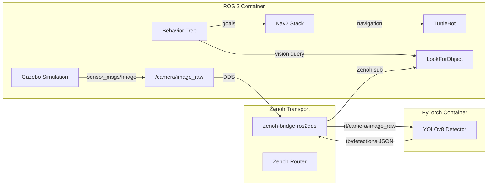
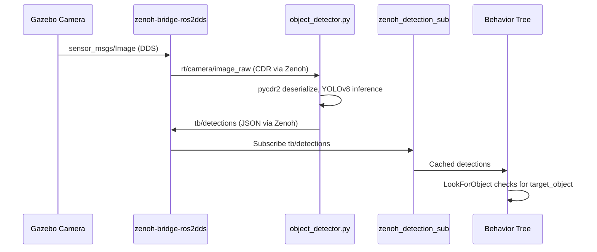

# TurtleBot Behavior Demos

Autonomous navigation demos for a simulated [ROBOTIS TurtleBot](https://emanual.robotis.com/docs/en/platform/turtlebot3/overview/#overview) using ROS 2 Jazzy and behavior trees.

The robot navigates a house environment searching for objects using vision (HSV color thresholding or YOLOv8 deep learning) and [Nav2](https://docs.nav2.org/)-based path planning.

**Behavior trees** drive the autonomy — see [this introduction](https://roboticseabass.com/2021/05/08/introduction-to-behavior-trees/) or the [BT textbook](https://arxiv.org/abs/1709.00084).
Docker workflows follow [this guide](https://roboticseabass.com/2023/07/09/updated-guide-docker-and-ros2/).

Originally by Sebastian Castro, 2021-2024.

---

## Architecture

### System Overview



### Docker Services

| Service | Image / Dockerfile | Purpose |
|---|---|---|
| `base` | `Dockerfile.gpu` → `base` | ROS 2 Jazzy + Cyclone DDS + Gazebo dependencies |
| `overlay` | `Dockerfile.gpu` → `overlay` | Adds `tb_autonomy` + `tb_worlds` packages, Nav2, BT libs |
| `dev` | `Dockerfile.gpu` → `dev` | Development container with source mounts + Groot2 |
| `demo-world` | extends `overlay` | Launches Gazebo house world |
| `demo-world-enhanced` | extends `overlay` | Enhanced world with 3m textured walls and ArUco markers |
| `demo-behavior-py` | extends `overlay` | Python behavior tree demo (py_trees) |
| `demo-behavior-cpp` | extends `overlay` | C++ behavior tree demo (BehaviorTree.CPP) |
| `zenoh-router` | `eclipse/zenoh:latest` | Zenoh router for pub/sub discovery |
| `zenoh-bridge` | extends `overlay` | `zenoh-bridge-ros2dds` — bridges DDS topics to Zenoh keys |
| `detector` | `Dockerfile.torch.gpu` | PyTorch YOLOv8 object detector (zero ROS dependencies) |

### Vision Pipeline

Two detection modes, switchable via the `DETECTOR_TYPE` environment variable:


### Repository Layout

```
turtlebot-maze/
├── tb_autonomy/              # ROS 2 autonomy package
│   ├── python/tb_behaviors/  #   Python behavior library (vision, navigation)
│   ├── scripts/              #   ROS nodes (autonomy_node, zenoh_detection_sub)
│   ├── launch/               #   Launch files (py + cpp demos)
│   ├── src/                  #   C++ behavior tree plugins
│   └── include/              #   C++ headers
├── tb_worlds/                # Gazebo worlds, maps, Nav2 config
├── detector/                 # Standalone PyTorch detector (no ROS)
│   ├── object_detector.py    #   Zenoh sub → YOLOv8 → Zenoh pub
│   └── requirements.txt      #   ultralytics, eclipse-zenoh, pycdr2
├── docker/                   # Dockerfiles + entrypoint
│   ├── Dockerfile.gpu        #   Multi-stage ROS 2 build (base/overlay/dev)
│   └── Dockerfile.torch.gpu  #   PyTorch container (CUDA + Ultralytics)
├── bt_xml/                   # Behavior tree XML definitions
├── docker-compose.yaml       # All service definitions
└── .env                      # Default environment variables
```

### Key Parameters

| Parameter | Default | Options | Description |
|---|---|---|---|
| `ROS_DISTRO` | `jazzy` | — | ROS 2 distribution |
| `TURTLEBOT_MODEL` | `3` | `3`, `4` | TurtleBot model |
| `BT_TYPE` | `queue` | `naive`, `queue` | Behavior tree variant |
| `ENABLE_VISION` | `true` | `true`, `false` | Enable vision behaviors |
| `TARGET_COLOR` | `blue` | `red`, `green`, `blue` | HSV detection target |
| `DETECTOR_TYPE` | `hsv` | `hsv`, `yolo` | Vision pipeline mode |
| `TARGET_OBJECT` | `cup` | Any COCO class | YOLO detection target |

---

## Setup

### Docker Setup (Recommended)
First, install Docker and Docker Compose using [the official install guide](https://docs.docker.com/engine/install/ubuntu/).

To run Docker containers with NVIDIA GPU support, you can optionally install the [NVIDIA Container Toolkit](https://github.com/NVIDIA/nvidia-docker).


First, clone this repository and go into the top-level folder:

```
git clone https://github.com/sea-bass/turtlebot3_behavior_demos.git
cd turtlebot3_behavior_demos
```

Build the Docker images.
This will take a while and requires approximately 5 GB of disk space.

```
docker compose build
```

### Local Setup

If you do not want to use Docker, you can directly clone this package to a Colcon workspace and build it provided you have the necessary dependencies.
As long as you can run the examples in the [TurtleBot3 manual](https://emanual.robotis.com/docs/en/platform/turtlebot3/overview/#overview), you should be in good shape.

First, make a Colcon workspace and clone this repo there:

```
mkdir -p turtlebot3_ws/src
cd turtlebot3_ws/src
git clone https://github.com/sea-bass/turtlebot3_behavior_demos.git
```

Clone the external dependencies:

```
sudo apt-get install python3-vcstool
vcs import < turtlebot3_behavior_demos/dependencies.repos
```

Set up any additional dependencies using rosdep:

```
sudo apt update && rosdep install -r --from-paths . --ignore-src --rosdistro $ROS_DISTRO -y
```

Ensure you have the necessary Python packages for these examples:

```
pip3 install matplotlib transforms3d
```

Then, build the workspace.

```
cd turtlebot3_ws
colcon build
```

NOTE: For best results, we recommend that you change your ROS Middleware (RMW) implementation to Cyclone DDS by following [these instructions](https://docs.ros.org/en/jazzy/Installation/RMW-Implementations/DDS-Implementations/Working-with-Eclipse-CycloneDDS.html).

---

## Basic Usage

We use [Docker Compose](https://docs.docker.com/compose/) to automate building, as shown above, but also for various useful entry points into the Docker container once it has been built.
**All `docker compose` commands below should be run from your host machine, and not from inside the container**.

To enter a Terminal in the overlay container:

```
docker compose run overlay bash
```

Once inside the container, you can verify that display in Docker works by starting a basic Gazebo simulation included in the standard TurtleBot3 packages:

```
ros2 launch turtlebot3_gazebo turtlebot3_world.launch.py
```

Alternatively, you can use the pre-existing `sim` service to do this in a single line:

```
docker compose up sim
```

If you want to develop using Docker, you can also launch a dev container using:

```
# Start the dev container
docker compose up dev

# Open as many interactive shells as you want to the container
docker compose exec -it dev bash
```

---

## Behavior Trees Demo

The robot navigates known locations searching for objects. Two vision modes are available:

- **HSV mode** (default): Color thresholding in the [HSV color space](https://en.wikipedia.org/wiki/HSL_and_HSV) — finds colored blocks (red, green, blue)
- **YOLO mode**: YOLOv8 deep learning — detects any [COCO class](https://docs.ultralytics.com/datasets/detect/coco/) object (cup, bottle, chair, etc.)

### Starting the Simulation

```bash
docker compose up demo-world
```

### HSV Mode (Default)

```bash
# Python behavior tree
docker compose up demo-behavior-py

# With custom parameters
TARGET_COLOR=green BT_TYPE=queue ENABLE_VISION=true docker compose up demo-behavior-py
```

### YOLO Mode (Deep Learning)

YOLO mode requires the Zenoh bridge and PyTorch detector services:

```bash
# Start Zenoh transport + detector
docker compose up zenoh-router zenoh-bridge detector

# In another terminal, start the behavior demo with YOLO mode
DETECTOR_TYPE=yolo TARGET_OBJECT=cup docker compose up demo-behavior-py
```

### Behavior Trees in Python

Uses [`py_trees`](https://py-trees.readthedocs.io/en/devel/) for behavior tree execution.

Customize via environment variables or the `.env` file:

```bash
TARGET_COLOR=green BT_TYPE=queue ENABLE_VISION=true docker compose up demo-behavior-py
```

Note that the behavior tree viewer ([`py_trees_ros_viewer`](https://github.com/splintered-reality/py_trees_ros_viewer)) should automatically discover the ROS node containing the behavior tree and visualize it.

After starting the commands above (plus doing some waiting and window rearranging), you should see the following.
The labeled images will appear once the robot reaches a target location.


### Behavior Trees in C++

Uses [`BehaviorTree.CPP`](https://www.behaviortree.dev/) with [Groot2](https://www.behaviortree.dev/groot/) for visualization.

```bash
docker compose up demo-behavior-cpp

# With custom parameters
TARGET_COLOR=green BT_TYPE=queue ENABLE_VISION=true docker compose up demo-behavior-cpp
```

YOLO mode works the same way — start the Zenoh + detector services, then:

```bash
DETECTOR_TYPE=yolo TARGET_OBJECT=cup docker compose up demo-behavior-cpp
```

> **Note:** Groot2 PRO is required for live behavior tree updates. Students can get a free license at [behaviortree.dev](https://www.behaviortree.dev/groot/).


---

## Enhanced Maze World

An optional world variant with taller textured walls and ArUco markers, designed for vision-based navigation and SLAM testing. The original `demo-world` remains unchanged.

### What's Different

| Feature | `demo-world` | `demo-world-enhanced` |
|---------|-------------|----------------------|
| Wall height | 1 m | 3 m |
| Wall appearance | Default gray (`Gazebo/Wood`) | PBR textures with color fallbacks (brick red, concrete gray, wood brown) |
| ArUco markers | None | Two markers (IDs 60 and 80) spawned at runtime |
| Map / Nav2 config | `sim_house_map.yaml` | Same — wall footprint is unchanged |

### Launch

```bash
# Build (only needed once)
docker compose build demo-world-enhanced

# Launch the enhanced world
docker compose up demo-world-enhanced
```

> **Warning:** Do not run `demo-world` and `demo-world-enhanced` simultaneously. Both use `network_mode: host`, so two gz-sim instances will compete for the same ports.

The enhanced world is fully compatible with all behavior demos — just start `demo-world-enhanced` instead of `demo-world`, then run `demo-behavior-py` or `demo-behavior-cpp` as usual.

### Launch Parameters

The enhanced world is controlled through launch arguments on `tb_demo_world.launch.py`:

| Parameter | Default | Description |
|-----------|---------|-------------|
| `world_name` | `sim_house.sdf.xacro` | World filename relative to `tb_worlds/worlds/` |
| `use_aruco` | `False` | Spawn ArUco markers in the environment |

### Why Taller Walls Help SLAM

The 3-meter walls provide significantly more vertical surface for lidar and depth cameras. This improves:

- **2D SLAM** — more consistent scan matching since the lidar always hits a wall (no "over the wall" gaps)
- **3D SLAM** — depth cameras see wall surfaces at varying heights, producing denser point clouds
- **Visual SLAM** — textured walls provide distinctive visual features for loop closure and relocalization
- **ArUco localization** — markers at known positions enable camera-based pose estimation as a complement to lidar SLAM

### Files

| File | Purpose |
|------|---------|
| `tb_worlds/worlds/sim_house_enhanced.sdf.xacro` | Enhanced world (3m walls, PBR textures, color fallbacks) |
| `tb_worlds/worlds/textures/` | Wall texture images (brick, concrete, wood) |
| `tb_worlds/models/aruco_id_{60,80}/` | ArUco marker models with OBJ meshes |
| `tb_worlds/launch/aruco_marker_spawner.launch.py` | Spawns ArUco markers with 10s delay |

---

## Visual SLAM with stella_vslam

Run [stella_vslam](https://github.com/stella-cv/stella_vslam) Visual SLAM on the TurtleBot's camera feed. The SLAM container subscribes to camera images via Zenoh (same transport pattern as the YOLO detector) and builds a 3D map of the environment.

The enhanced maze world (`demo-world-enhanced`) with textured walls provides significantly better visual features for SLAM compared to the original featureless walls.

### Launch

```bash
# Terminal 1: Enhanced world (textured walls)
docker compose up demo-world-enhanced

# Terminal 2: Zenoh transport
docker compose up zenoh-router zenoh-bridge

# Terminal 3: Visual SLAM
docker compose up demo-slam
```

Pose estimates are published over Zenoh on key `tb/slam/pose` as JSON.

### Data Flow

Camera images flow from Gazebo through the Zenoh bridge to the SLAM container:

```
Gazebo Camera → DDS → zenoh-bridge → Zenoh → slam_bridge.py → stella_vslam
```

Pose estimates are published back via Zenoh on key `tb/slam/pose`.

---

## Zenoh + YOLOv8 Object Detection

The YOLO pipeline uses [Eclipse Zenoh](https://zenoh.io/) to decouple the ROS 2 simulation from the PyTorch inference container. This follows the [zenoh-python-lidar-plot](https://github.com/eclipse-zenoh/zenoh-demos/tree/main/ROS2/zenoh-python-lidar-plot) pattern.

### Data Flow



### Zenoh Key Expressions

| Key | Direction | Format | Description |
|---|---|---|---|
| `rt/camera/image_raw` | ROS → Detector | CDR (`sensor_msgs/Image`) | Camera frames (auto-bridged) |
| `tb/detections` | Detector → ROS | JSON array | Detection results |

### Detection JSON Format

```json
[
  {"class": "cup", "confidence": 0.87, "bbox": [120, 80, 250, 310]},
  {"class": "bottle", "confidence": 0.72, "bbox": [300, 100, 380, 350]}
]
```

### Detector CLI Options

```bash
python object_detector.py \
  --model yolov8n.pt \
  --confidence 0.5 \
  --max-fps 10 \
  --image-key "rt/camera/image_raw" \
  --detection-key "tb/detections"
```

---

## ros-mcp-server Navigation Demo

Control the TurtleBot from [Claude Code](https://claude.com/product/claude-code) using natural language. The [ros-mcp-server](https://github.com/robotmcp/ros-mcp-server) connects Claude to the ROS 2 navigation stack via rosbridge WebSocket.

### Setup

1. Start the simulation and rosbridge:

```bash
# Terminal 1: Launch Gazebo + Nav2
docker compose up demo-world

# Terminal 2: Start rosbridge WebSocket (port 9090)
docker compose up rosbridge
```

2. Open the project in Claude Code.

### Usage

Type `/navigate` in Claude Code. The slash command will:

1. Connect to the robot via rosbridge
2. Verify Nav2 is ready
3. Show the robot's current position
4. Ask you to pick a destination (4 predefined locations in the house)
5. Send a navigation goal (you'll be asked to approve this action)
6. Monitor progress and confirm arrival

### Safety

The `send_action_goal` tool requires manual approval each time it is called. This is an intentional safety gate for robot-commanding operations.
